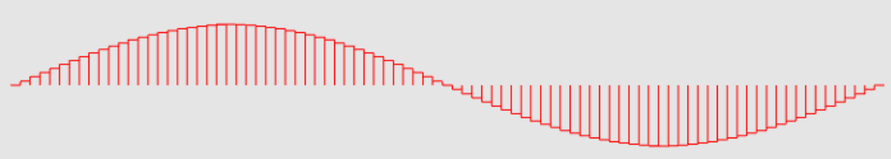
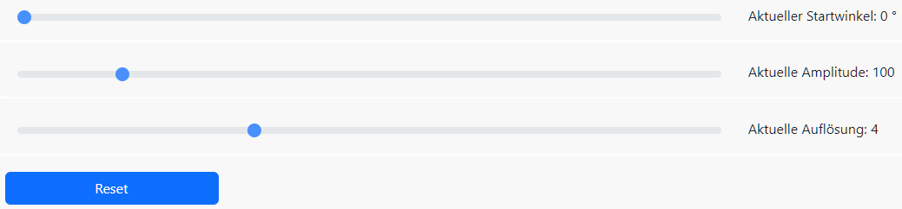

---

**Graphical Visualisation Technologies**

**Dozent: Prof. Dr. Felix Gers (Berliner Hochschule für Technik)**

**Studiengang Medieninformatik Online MA, Wintersemester 2022/23**

**University of Applied Sciences Emden/Leer, Faculty of Technology, Department of Electrical Engineering and
Informatics**

---

### Einsendeaufgabe EA2 : 2D-Geometrie aus Linien.

[zur Webseite](https://gvt.ckitte.de/ea2/)

Im Rahmen der zweiten Einsendeaufgabe sollte eine 2D-Geometrie aus Linien erzeugt und mittels WebGL dargestellt werden. Dabei konnte frei zwischen GL_LINES, GL_LINE_STRIP oder GL_LINE_LOOP gewählt werden.

Für meine Abgabe habe ich mich für die Ausgabe einer dynamisch änderbaren Sinuswelle entschieden, welche fest über 90 berechnete Punkte ausgegeben wird. Mit den unten eingestellten Werten wird so eine vollständige Sinusschwingung ausgegeben. Die Sinuswelle wird hierbei alleine durch vertikale und horizontale Linien erzeugt, welche letzlich die Säulen der Sinuswelle wiedergeben.

Die Sinuswelle kann anhand von drei Parametern verändert werden.  Mit Startwinkel wird der erste Winkel festgelegt, mit Amplitude erfolgt eine Skalierung des Funktionswertes. Die Auflösung ändert die Breite der verwendeten Balken und somit die Auflösung. Der Resetbutton stellt die anfänglichen Werte wieder her.

Als Startseite dient wie üblich eine **index.html**. Die Datei **main.css** enthält alle benötigten Klassen, um die Grafik einfach einzubinden. In der Datei **layout.css** wird das Layout der Webseite selbst festgelegt. Daneben kommt Bootstrap für die Buttons zum Einsatz. Die gesamte Logik der Anwendung befindet sich in der Datei **main.js**.

Der Canvas als zentrales Ausgabeobjekt wurde in der Index.html angelegt und mit einer fixen Breite von 1000px belegt. Alle anderen Einstellungen erfolgen über CSS.
